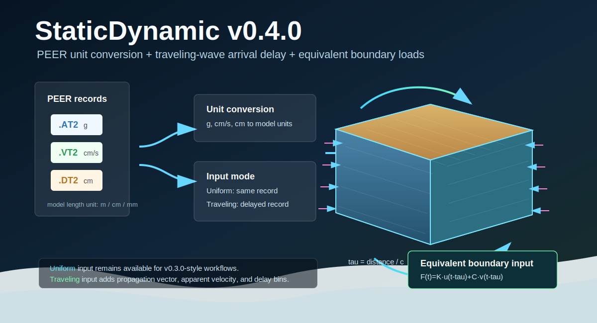
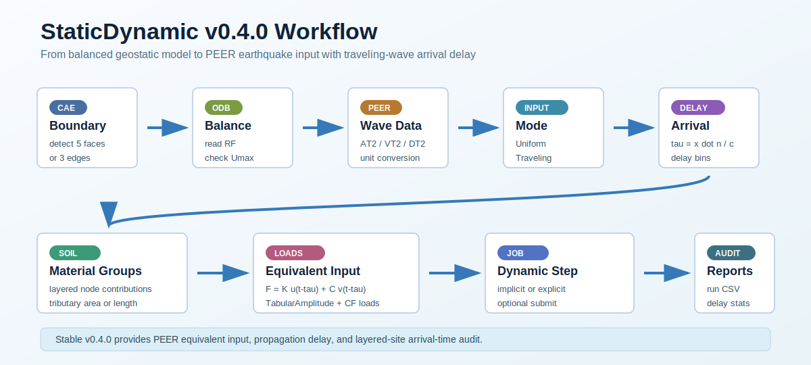

# StaticDynamic Abaqus Plugin

[中文说明](README.zh-CN.md)

Current release version: `0.4.0`

Latest stable release: `0.4.0`

StaticDynamic is an Abaqus/CAE Python plugin for soil static-dynamic analysis with viscous-spring artificial boundaries.

<p align="center">
  
</p>

The current implementation focuses on a practical CAE workflow:

- identify 3D five-face artificial boundaries or 2D three-edge artificial boundaries
- compute viscous-spring boundary parameters from soil material properties, with
  boundary-node grouping for layered soil models
- apply visual `SpringDashpotToGround` features in Abaqus/CAE
- weight nodal spring-dashpot coefficients by tributary area or length
- run geostatic equilibrium, read boundary reaction forces, and apply equivalent reaction-balance nodal loads
- read PEER `.AT2/.VT2/.DT2` earthquake motions with unit conversion
- apply equivalent seismic nodal forces from boundary spring-dashpot coefficients
- provide a GUI workflow for node-set generation, boundary application, and optional dynamic analysis setup

## Visual Overview

The plugin converts a balanced geostatic soil model into a dynamic model with
weighted viscous-spring artificial boundaries. Boundary nodes are grouped by
face or edge, soil material contribution, and tributary area or length.

<p align="center">
  
</p>

### GUI Workflow

The Abaqus/CAE dialog keeps the model setup, geostatic reaction source,
dynamic-analysis parameters, and optional output controls in one workflow.

<p align="center">
  
</p>

### Boundary Application Examples

Captured directly from Abaqus/CAE with the generated `SpringDashpotToGround`
features visible in the interaction display.

<table>
  <tr>
    <td width="50%" align="center">
      <br>
      <sub>Overall interaction view with visual viscous-spring boundary symbols.</sub>
    </td>
    <td width="50%" align="center">
      <br>
      <sub>Side boundary detail with layered node grouping.</sub>
    </td>
  </tr>
</table>

## Status

This project is under active development. The 3D five-face viscous-spring boundary workflow has been tested on a regular homogeneous soil model. Layered soil boundary grouping is implemented for common horizontal layered models by reading adjacent boundary element materials. Version `0.3.0` added practical PEER earthquake-motion input through equivalent spring-dashpot boundary nodal forces. Version `0.4.0` improves incident-wave input with spatial arrival-time delay and a first layered-site travel-time mode.

## Supported Environment

- Abaqus/CAE 2021-style Python plugin workflow
- Abaqus kernel Python 2.7 compatibility style
- Windows plugin directory workflow

## Installation

Copy this repository folder into an Abaqus plugin search path, for example:

```text
C:\Users\<USER>\abaqus_plugins\StaticDynamic_v1
```

Restart Abaqus/CAE. The plugin should appear as `StaticDynamic v0.4.0` in the plugin menu.

## Basic Workflow

1. Open or create a soil model in Abaqus/CAE.
2. Ensure the soil part has elastic and density material properties.
3. Open the StaticDynamic plugin dialog.
4. Set model name, soil part, soil instance, and vertical axis (`X`, `Y`, or `Z`).
5. Choose one of the workflows:
   - node set only
   - geostatic equilibrium plus viscous-spring boundary
   - full dynamic workflow
6. Run the plugin.
7. Inspect generated assembly sets and visual `SpringDashpotToGround` features.
8. Review `StaticDynamic_run_report.txt` or `StaticDynamic_run_report.csv`.
9. Open the geostatic ODB and check the final-frame displacement field `U`.

## Geostatic Balance Input

The plugin does not compute geostatic balance internally. Complete geostatic
balance first, verify that the final displacement field `U` is acceptable, and
then provide the balanced reaction source to this plugin:

- `ODB`: read boundary node `RF` from the specified step in a balanced ODB.
  The plugin checks the final-frame displacement field `U` before conversion;
  the default tolerance is `1.0e-4`.
- `CSV`: read boundary node reactions from a CSV file with columns
  `nodeLabel, RF1, RF2, RF3` or the same four columns without a header.
  CSV input cannot verify displacement balance, so the user must ensure the
  source model is already balanced.

This keeps staged construction, contact, excavation, tunnels, piles, and other
complex soil-structure balance workflows outside the boundary-conversion plugin.

When `Node Information` is enabled, the plugin exports `BoundaryInfo.csv` with
node coordinates, boundary face name, material fractions, and tributary area or
length. This file can be used to build or audit external geostatic reaction CSVs.

## Seismic Motion Input

Version `0.3.0` supports PEER NGA strong-motion text files:

```text
.AT2  acceleration, usually in g
.VT2  velocity, usually in cm/s
.DT2  displacement, usually in cm
```

Select any one component file, such as `RSN1547_CHICHI_TCU123-E.AT2`. The plugin
automatically loads matching `.VT2` and `.DT2` files with the same base name when
they are present.

The `Model Length Unit` option controls PEER unit conversion:

```text
m   AT2 g -> m/s^2,  VT2 cm/s -> m/s,  DT2 cm -> m
cm  AT2 g -> cm/s^2, VT2 cm/s -> cm/s, DT2 cm -> cm
mm  AT2 g -> mm/s^2, VT2 cm/s -> mm/s, DT2 cm -> mm
```

For each boundary spring-dashpot group, the plugin creates equivalent seismic
nodal loads in the dynamic step:

```text
F(t) = K_node * u_g(t) + C_node * v_g(t)
```

where `u_g(t)` and `v_g(t)` are the converted displacement and velocity time
series. If only acceleration or velocity is available, the missing lower-order
series is generated by trapezoidal integration. The global input direction is
defined by `Incident Vector`; use a negative component to reverse direction.

### Traveling-Wave Input

Version `0.4.0` adds a first incident-wave input mode:

- `Input Mode = Uniform`: all artificial-boundary nodes use the same record.
- `Input Mode = Traveling`: boundary nodes are grouped by arrival delay.
- `Input Mode = LayeredSite`: boundary nodes are grouped by a 1D site-column
  delay estimated from the model material `Vs` values along the selected
  vertical axis.
- `Incident Vector`: motion or force direction.
- `Propagation Vector`: wave travel direction used for arrival-time delay.
- `Apparent Velocity`: propagation speed in the selected model length unit per
  second.
- `Delay Bin Size`: optional delay grouping interval; `0` uses the wave-record
  time increment automatically.

For a node at coordinate `x_i`, the traveling-wave delay is:

```text
tau_i = ((x_i - x_ref) dot n) / c_app
F_i(t) = K_i * u_g(t - tau_i) + C_i * v_g(t - tau_i)
```

where `n` is the normalized `Propagation Vector`, `c_app` is `Apparent
Velocity`, and `x_ref` is the leading boundary projection. This is a spatial
arrival-time correction, not yet a full free-field wave scattering solution.

Traveling-wave input also writes `SeismicArrivalInfo.csv` with each boundary
node's arrival delay. The run report records delay range and delay-bin counts
globally and per boundary face. To prevent accidental creation of an excessive
number of Abaqus amplitudes and loads, the current safety limit is 200 delay
bins; increase `Delay Bin Size` if this limit is reached. The plugin also emits
warnings when `P`/`S` wave type and the incident/propagation vectors look
physically inconsistent.

`LayeredSite` is a conservative site-analysis bridge for `v0.4.0`: it reads the
layered soil stiffness/density already used for the viscous-spring boundary,
builds an equivalent vertical `Vs` profile, writes `SeismicSiteProfile.csv`,
and applies depth-dependent arrival delays. It is a 1D kinematic travel-time
correction only; it does not yet perform equivalent-linear amplification,
deconvolution, or full free-field column coupling.

## Roadmap

The next `v0.5.0` development target is a more complete earthquake-input workbench:

- equivalent-linear site response and free-field column coupling
- clearer selection and scaling workflow for PEER records before model input
- checks for multi-component horizontal and vertical motion consistency

## Preflight and Run Reports

Version `0.2.1` added a preflight check before boundary conversion. The plugin
now
stops early when required model inputs are missing or inconsistent, including:

- missing part, instance, or mesh nodes
- incompatible function selections
- missing or mismatched ODB/CSV geostatic files
- non-positive structure depth when spring damping is enabled
- non-positive geostatic balance tolerance

Each run writes:

```text
StaticDynamic_run_report.txt
StaticDynamic_run_report.csv
```

The report records inputs, preflight warnings/errors, boundary face node counts,
tributary area or length totals, material grouping summary, geostatic reaction
read statistics, spring-dashpot group counts, reaction-balance load counts, and
job setup information.

## Lightweight Validation

The repository includes an Abaqus-session validation helper:

```text
examples/validate_current_session.py
```

Run it from Abaqus/CAE or Abaqus Python after loading the sample validation
models. It checks boundary detection and tributary weight totals without
submitting jobs or opening ODB files.

## Boundary Logic

For a 3D soil domain with a free top surface, artificial boundaries are applied to:

- bottom face
- two X-side faces
- two horizontal-side faces normal to the other horizontal axis

For a 2D planar model, artificial boundaries are applied to:

- bottom edge
- left edge
- right edge

Top free surfaces are not treated as artificial boundaries. After a run, the
viewport is automatically oriented so the selected vertical axis is displayed
upright; this changes only the view, not the model coordinates.

## Nodal Weighting

The plugin computes nodal tributary area for 3D boundary faces and tributary length for 2D boundary edges. Nodal coefficients are applied as:

```text
K_node = A_node * K_boundary
C_node = A_node * C_boundary
```

For 2D models, `A_node` is interpreted as tributary length.

## References

The implementation is based on the common viscous-spring artificial boundary approach used in soil-structure interaction analysis, including the static-dynamic unified artificial boundary ideas associated with Liu Jingbo and coauthors.

Do not treat this repository as a substitute for validating boundary parameters for your own model. Always compare against benchmark cases before production use.

## Repository Contents

```text
StaticDynamic.py              Core Abaqus kernel logic
staticDynamic_Form.py         Abaqus/CAE GUI dialog
staticDynamicDB.py            Data and file helpers
staticDynamic_plugin.py       Plugin entry point
staticDynamic_ToolBar.py      Compatibility placeholder
icons/                        Plugin icons
docs/                         Theory and workflow notes
examples/                     Example notes and validation summaries
```

## License

MIT License.
