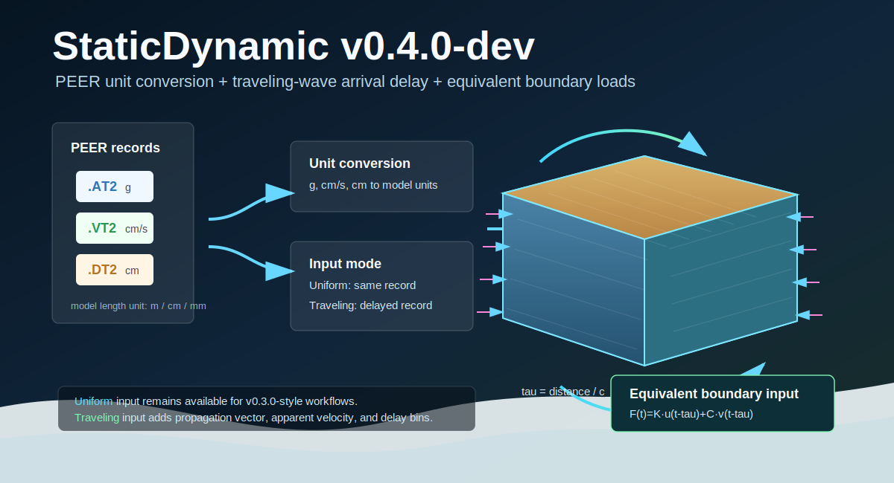
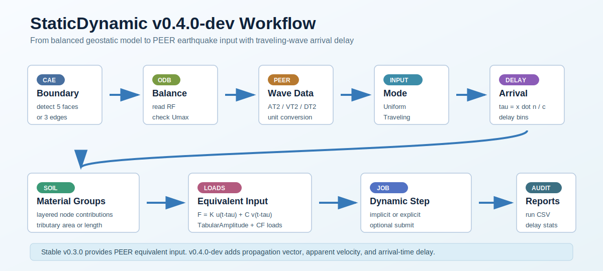
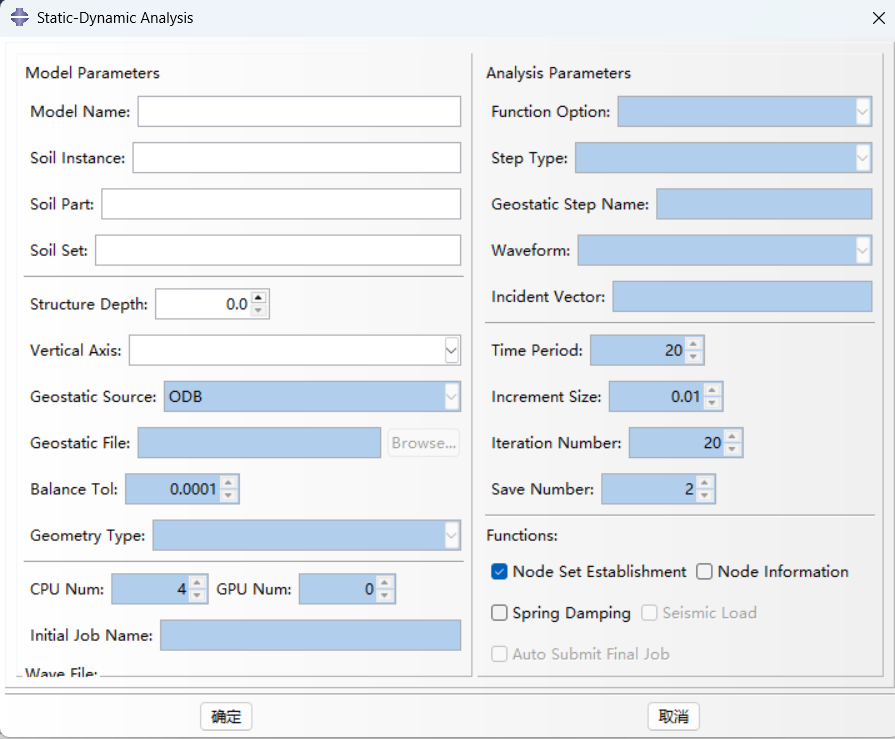
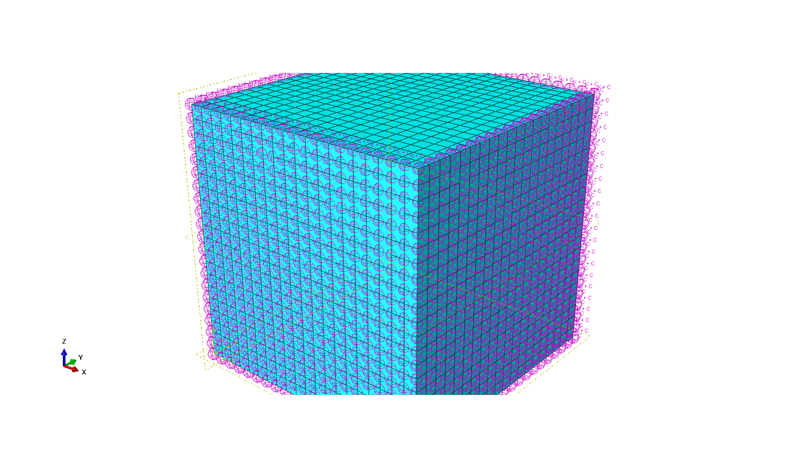
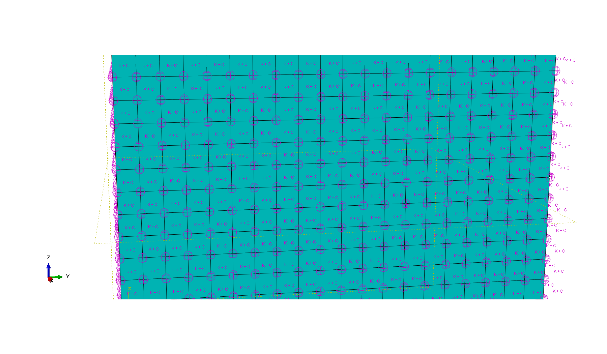

# StaticDynamic Abaqus 插件

[English README](README.md)

当前开发版本：`0.4.0-dev`

最新稳定版本：`0.3.0`

StaticDynamic 是一个 Abaqus/CAE Python 插件，用于土体静动力转换和粘弹性人工边界施加。当前版本重点支持复杂土-结构模型的外部地应力平衡结果导入，再由插件完成边界节点识别、反力读取、粘弹性边界施加和静力反力回填。

<p align="center">
  
</p>

## 页面概览

插件将已经完成地应力平衡的土体模型转换为带粘弹性人工边界的动力分析模型。程序会按边界面/边、相邻材料贡献和节点控制面积或长度，对边界节点进行分组和加权。

<p align="center">
  
</p>

### 插件 GUI

Abaqus/CAE 对话框将模型参数、地应力反力来源、动力分析参数和可选输出控制集中在同一套流程中。

<p align="center">
  
</p>

### 粘弹性边界施加示例

以下图片直接截取自 Abaqus/CAE，相互作用显示中可见插件生成的 `SpringDashpotToGround` 粘弹性边界符号。

<table>
  <tr>
    <td width="50%" align="center">
      <br>
      <sub>整体相互作用视图，可见粘弹性边界符号。</sub>
    </td>
    <td width="50%" align="center">
      <br>
      <sub>侧边界细节视图，可见分层节点分组。</sub>
    </td>
  </tr>
</table>

## 主要功能

- 自动识别 3D 五个截断边界面，或 2D 三条截断边界边。
- 支持 `X / Y / Z` 竖向轴选择，并自动调整 Abaqus 视图。
- 支持多层土体边界参数：按边界相邻单元材料自动分组。
- 层间界面节点按相邻材料贡献分摊弹簧和阻尼。
- 根据节点控制面积或控制长度加权粘弹性边界参数。
- 使用 Abaqus 可视化的 `SpringDashpotToGround` 施加粘弹性边界。
- 支持从外部地应力平衡结果读取边界反力：
  - `ODB`：从平衡后的 ODB 指定 step 最后一帧读取 `RF`。
  - `CSV`：读取边界节点反力表。
- ODB 输入时检查最后一帧位移场 `U`，默认容许值为 `1.0e-4`。
- 导出 `BoundaryInfo.csv`，用于外部地应力反力表生成和核对。
- 支持 PEER `.AT2/.VT2/.DT2` 地震动文件读取和单位转换。
- 根据边界弹簧阻尼参数生成等效地震输入节点荷载。

## 适用思路

插件不再内部求解地应力平衡。复杂结构、分步施工、接触、开挖、隧道、桩土等问题，应先在 Abaqus 中按真实工况完成地应力平衡，并确认最后一帧位移场 `U` 满足工程要求。随后将平衡后的 ODB 或边界反力 CSV 提供给本插件，插件负责完成静力边界到粘弹性动力边界的转换。

## 安装

将本仓库文件夹复制到 Abaqus 插件搜索路径，例如：

```text
C:\Users\<USER>\abaqus_plugins\StaticDynamic_v1
```

重启 Abaqus/CAE 后，插件菜单中应出现 `StaticDynamic v0.4.0-dev`。

## 基本流程

1. 在 Abaqus/CAE 中打开或建立土体模型。
2. 确保土体材料包含弹性参数和密度。
3. 在模型中完成地应力平衡，并检查 ODB 最后一帧 `U`。
4. 打开 StaticDynamic 插件。
5. 填写模型名、土体部件名、实例名、节点集和竖向轴。
6. 选择地应力反力来源：
   - `ODB`
   - `CSV`
7. 选择地应力文件和 step 名称。
8. 若进行动力分析，选择 PEER 地震动文件，并设置 `Model Length Unit`。
9. 勾选 `Node Set Establishment`、`Spring Damping` 和需要的 `Seismic Load`。
10. 运行插件。
11. 检查生成的节点集、`SpringDashpotToGround`、`SD_RF_*` 反力荷载和 `SD_EQLoad_*` 地震等效荷载。

## 地应力输入

### ODB

ODB 输入要求：

- ODB 来自已经完成地应力平衡的模型。
- 指定 step 的最后一帧包含 `U` 和 `RF` 场输出。
- ODB 中的实例名和当前 CAE 模型中的土体实例名一致。
- 边界节点编号和当前模型一致。

插件会检查最大位移：

```text
Umax <= Balance Tol
```

默认：

```text
Balance Tol = 1.0e-4
```

若不满足，插件会停止静动边界转换。

### CSV

CSV 输入格式：

```csv
nodeLabel,RF1,RF2,RF3
1,-441759.12,441759.12,1293986.8
2,-441759.12,-441759.12,1293986.8
```

也支持无表头四列数据：

```csv
1,-441759.12,441759.12,1293986.8
2,-441759.12,-441759.12,1293986.8
```

CSV 方式无法检查位移场，用户需要自行保证地应力平衡已经满足要求。

## 地震动输入

第三版支持 PEER NGA 强震动文本文件：

```text
.AT2  加速度，PEER 常用单位为 g
.VT2  速度，PEER 常用单位为 cm/s
.DT2  位移，PEER 常用单位为 cm
```

在 `Wave File` 中选择任意一个分量文件，例如
`RSN1547_CHICHI_TCU123-E.AT2`。若同目录下存在同名 `.VT2` 和 `.DT2`
文件，插件会自动一起读取。

`Model Length Unit` 必须与 Abaqus 模型长度单位一致，插件按以下方式换算：

```text
m   AT2 g -> m/s^2,  VT2 cm/s -> m/s,  DT2 cm -> m
cm  AT2 g -> cm/s^2, VT2 cm/s -> cm/s, DT2 cm -> cm
mm  AT2 g -> mm/s^2, VT2 cm/s -> mm/s, DT2 cm -> mm
```

对每组边界弹簧阻尼节点，插件在动力步中生成等效地震输入荷载：

```text
F(t) = K_node * u_g(t) + C_node * v_g(t)
```

其中 `u_g(t)` 和 `v_g(t)` 是换算到模型单位后的位移和速度时程。若只提供加速度或速度记录，插件会用梯形积分生成缺失的低阶时程。`Incident Vector` 用于控制全局输入方向，负号可用于反向输入。

### 行波输入

`0.4.0-dev` 已开始加入入射波到时差输入：

- `Input Mode = Uniform`：所有人工边界节点使用同一条时程。
- `Input Mode = Traveling`：按边界节点到时差分组施加时程。
- `Incident Vector`：运动或等效荷载方向。
- `Propagation Vector`：波传播方向，用于计算到时差。
- `Apparent Velocity`：表观传播速度，单位为模型长度单位/秒。
- `Delay Bin Size`：到时差分组间隔；填 `0` 时自动使用波形时间步长。

节点 `x_i` 的到时差计算为：

```text
tau_i = ((x_i - x_ref) dot n) / c_app
F_i(t) = K_i * u_g(t - tau_i) + C_i * v_g(t - tau_i)
```

其中 `n` 为归一化后的 `Propagation Vector`，`c_app` 为 `Apparent
Velocity`，`x_ref` 为最先到达的边界投影位置。这个功能是空间到时差修正，还不是完整自由场散射求解。

## 后续路线

`v0.4.0` 后续继续优化更真实的地震波输入：

- 场地反应前处理，支持基岩输入、自由场输入和土层放大关系。
- PEER 地震波选择、调幅、单位和峰值检查流程。
- 水平双分量和竖向分量组合输入的一致性检查。

## BoundaryInfo.csv

勾选 `Node Information` 后，插件会导出 `BoundaryInfo.csv`，字段包括：

```csv
nodeLabel,x,y,z,faceName,materialFractions,areaOrLength
```

该文件可用于：

- 核对自动识别的人工边界节点。
- 查看节点属于哪个边界面。
- 查看多层土材料分摊比例。
- 生成或审查外部边界反力 CSV。

## 边界逻辑

3D 土体自由顶面模型：

- 底面
- 两个 X 侧面
- 两个另一水平轴侧面

2D 土体模型：

- 底边
- 左边
- 右边

自由顶面不施加粘弹性人工边界。

## 验证状态

当前版本已验证：

- 均质 3D 土体五面粘弹性边界。
- 两层 3D 土体材料分组和界面节点分摊。
- 1 m 加密网格下的多层土边界识别。
- ODB 地应力反力输入。
- CSV 地应力反力输入。
- ODB 位移平衡阈值拦截。

## 注意

本插件不能替代工程模型验证。正式计算前，应使用基准算例、网格敏感性分析和足够远的截断边界距离验证边界参数。

## 许可证

MIT License.
