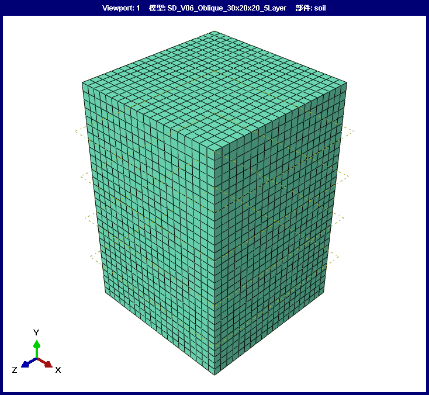
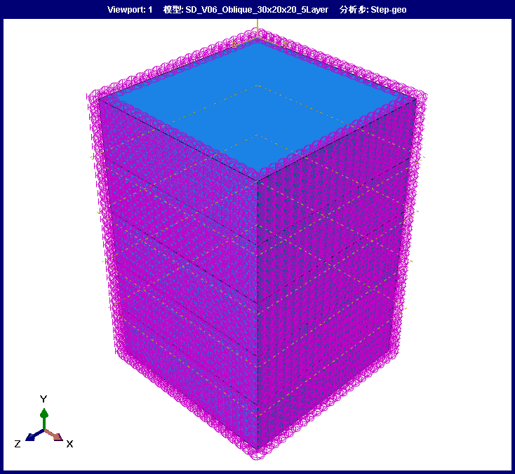
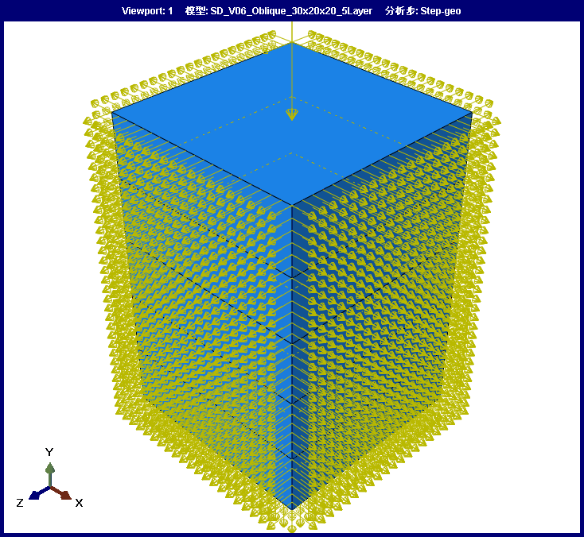

# StaticDynamic v0.6.0

This release adds arbitrary-angle oblique incident-wave controls on top of the
traveling-wave arrival-delay workflow.

## Highlights

- Added `Incident Angle` and `Azimuth` controls to the Abaqus/CAE dialog.
- When `Input Mode = Traveling` and `Propagation Vector` is blank, the plugin
  generates the propagation direction from the selected vertical axis, incident
  angle, and azimuth angle.
- Kept explicit `Propagation Vector` input as the highest-priority option for
  backward compatibility and special directions.
- Added `incident_angle_deg` and `azimuth_angle_deg` to the run report.

## Angle Convention

`Incident Angle` is measured in degrees from the selected `Vertical Axis`.
`Azimuth` is measured in the horizontal plane. For `Vertical Axis = Y`,
`Azimuth = 0` points along global X and `Azimuth = 90` points along global Z.

This is still a kinematic arrival-time correction for equivalent boundary
loads, not a full oblique-wave scattering or free-field coupling solver.

## Validation

The release was checked with syntax validation:

```text
python -m py_compile StaticDynamic.py staticDynamicDB.py staticDynamic_Form.py staticDynamic_plugin.py examples\validate_current_session.py
```

It was also verified in Abaqus/CAE with a full static-to-dynamic workflow:

- Model: `SD_V06_Oblique_30x20x20_5Layer`
- Geometry: 30 m embedment depth with a 20 m by 20 m plan
- Mesh: 1 m C3D8R mesh, 12,000 elements and 13,671 nodes
- Layers: five 6 m layers with a center-high stiffness profile
- Wave input: `RSN1949_ANZA1_ELS015.AT2/.VT2/.DT2`
- Oblique incidence: `Incident Angle = 32 deg`, `Azimuth = 0 deg`
- Propagation unit vector:
  `[0.529919264233205, 0.848048096156426, 0.0]`
- Geostatic job: `SD_V06_Geo_30x20x20_5Layer`, completed successfully
- Dynamic job: `SD_V06_Dyn_30x20x20_5Layer`, completed successfully
- Boundary reaction extraction: 2,841 boundary nodes
- Viscous-spring boundary features: 189 spring/dashpot features
- Reaction-balance loads: 2,841 `SD_RF_*` loads
- Oblique seismic equivalent loads: 514 `SD_EQLoad_*` loads with 514
  delayed amplitudes
- Arrival delay range: 0 to 0.14 s in 15 delay bins
- Dynamic ODB field outputs: `U`, `V`, `A`, and `RF` on 13,671 nodes

The validation artifacts are kept under:

```text
C:\Users\YANG\Desktop\ceshi\SD_V06_Oblique_30x20x20_5Layer
```

## Abaqus Screenshots

<p align="center">
  
</p>

<p align="center">
  <sub>Five-layer 30 m by 20 m by 20 m validation mesh, 1 m C3D8R elements.</sub>
</p>

<p align="center">
  
</p>

<p align="center">
  <sub>Generated viscous-spring boundary features on the five artificial boundary faces.</sub>
</p>

<p align="center">
  
</p>

<p align="center">
  <sub>Generated reaction-balance loads and 32 degree oblique seismic equivalent loads.</sub>
</p>
